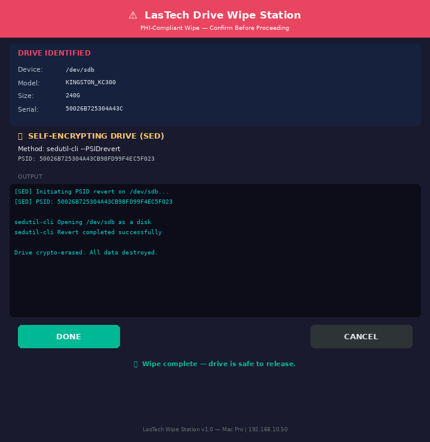

# LasTech Drive Wipe Station

Automated PHI-compliant drive wipe system for the LasTech Mac Pro wipe station (192.168.10.50, Linux Mint).

Handles both **self-encrypting drives (SEDs)** via `sedutil-cli` PSID revert and **standard drives** via `shred`. Triggered automatically by udev on drive insertion, with a GUI confirmation dialog, Telegram notifications, and a local audit log.

---

## GUI



*SED detected — showing PSID, live output pane, and post-wipe success state.*

---

## How It Works

1. Drive inserted into any hot-swap bay → udev fires
2. GUI launches on the monitor showing full drive identification (device, model, size, serial)
3. Drive is classified:
   - **Serial in KNOWN_SEDS table** → SED path — `sedutil-cli --PSIDrevert`
   - **Serial not recognized** → halts and requires manual classification before any action
   - **Unknown serial + manually confirmed non-SED** → shred path — `shred -v -n 1 -z`
4. PSID format validated before being passed to sedutil-cli
5. Two-step confirmation required: classification review → final irreversible-action dialog
6. Wipe executes with live output in the GUI terminal pane
7. Telegram notification sent asynchronously on start and completion
8. Entry written to `/var/log/lastech-wipe/wipe.log` (root-only, chmod 700 dir)

**Cardinal rule:** Serial number is always identified via `lsblk -o NAME,SIZE,MODEL,SERIAL` before any wipe command is issued. No exceptions.

---

## Files

| File | Installs To | Purpose |
|------|-------------|---------|
| `lastech-wipe-gui.py` | `/usr/local/bin/` | Main GUI + wipe logic (Python 3 / tkinter) |
| `lastech-wipe-trigger.sh` | `/usr/local/bin/` | udev → GUI bridge (safe X11 session detection) |
| `99-lastech-wipe.rules` | `/etc/udev/rules.d/` | udev trigger rule (sdb–sdz, disk type only) |
| `config.env.template` | `/etc/lastech-wipe/config.env` | Telegram credentials (root:root, chmod 600) |
| `install.sh` | — | Installer — handles all deps and setup |

---

## Installation

```bash
git clone https://github.com/TheLasTech/Wipe-station-automation-script.git
cd Wipe-station-automation-script
sudo bash install.sh
```

The installer handles:
- All apt dependencies (`python3`, `python3-tk`, `curl`, `util-linux`, `udev`)
- `sedutil-cli` auto-download (x86_64 static binary from Drive Trust Alliance)
- Log directory creation with root-only permissions (chmod 700)
- GUI script syntax verification before install
- udev rule install and reload
- Credentials config scaffolding (root:root, chmod 600)
- tkinter import verification with auto-fix attempt

---

## Post-Install (Required Before First Wipe)

### 1. Add Telegram Credentials
```bash
sudo nano /etc/lastech-wipe/config.env
```
Pull `TELEGRAM_BOT_TOKEN` and `TELEGRAM_CHAT_ID` from Vaultwarden. File is root:root, chmod 600 — never stored in plaintext anywhere else.

### 2. Get Real SED Serial Numbers
Insert each known SED one at a time and run:
```bash
lsblk -o NAME,SIZE,MODEL,SERIAL
```

### 3. Update KNOWN_SEDS Table
```bash
sudo nano /usr/local/bin/lastech-wipe-gui.py
```
Replace the placeholder keys (`SERIAL_MICRON_M550`, `SERIAL_KINGSTON_KC300`) with the real serial numbers from step 2.

### 4. Test
```bash
# Manual launch test (safe — no wipe without confirmation)
sudo python3 /usr/local/bin/lastech-wipe-gui.py /dev/sdb

# Then insert a drive to verify udev auto-launch
```

---

## Known SED Inventory

| Drive | Size | PSID |
|-------|------|------|
| Micron M550 | 256GB | `558AFE26-8BF3-0EE3-E100-000089C981EC` |
| Kingston KC300 | 240GB | `50026B725304A43CB98FD99F4EC5F023` |

PSIDs are physically printed on the drive label. Always verify before adding a new entry.

---

## Adding a New SED

1. Insert drive, get serial: `lsblk -o NAME,SIZE,MODEL,SERIAL`
2. Get PSID from the drive label sticker
3. Add entry to `KNOWN_SEDS` in `/usr/local/bin/lastech-wipe-gui.py`:

```python
"SERIALNUMBER": {
    "label": "Drive description",
    "psid":  "PSID-FROM-LABEL",
    "note":  "Optional note shown in GUI"
},
```

No restart or reload needed — script reads the table fresh on each launch.

---

## Security Notes

- Credentials stored in `/etc/lastech-wipe/config.env` (root:root, chmod 600) — populated from Vaultwarden, never committed to git
- Log directory `/var/log/lastech-wipe/` is chmod 700 — serial numbers not world-readable
- Device argument validated as an actual block device before any action
- PSID format validated (UUID or 32-char hex) before being passed to sedutil-cli
- Cooldown uses fcntl file locking — race-condition-free, prevents stacked GUIs from rapid insertions
- Telegram sends asynchronously — network latency never blocks or delays a wipe
- udev trigger safely detects active X11 session; logs and exits cleanly if none found
- `config.env` is in `.gitignore` — cannot be accidentally committed

---

## Log Format

`/var/log/lastech-wipe/wipe.log`

```
[2026-06-10 14:32:01] [START]   serial=50026B72... model=KINGSTON_KC300 Wipe started | device=/dev/sdb | method=SED PSID revert
[2026-06-10 14:32:04] [SUCCESS] serial=50026B72... model=KINGSTON_KC300 Wipe SUCCESS | device=/dev/sdb | method=SED PSID revert
[2026-06-10 14:45:11] [START]   serial=WD-WX31... model=WDC_WD10EZEX  Wipe started | device=/dev/sdc | method=shred
[2026-06-10 14:52:33] [SUCCESS] serial=WD-WX31... model=WDC_WD10EZEX  Wipe SUCCESS | device=/dev/sdc | method=shred -v -n 1 -z
```

---

## Manual Launch

```bash
sudo python3 /usr/local/bin/lastech-wipe-gui.py /dev/sdb
```

---

## Dependencies

- `python3` + `python3-tk` — GUI
- `sedutil-cli` — SED PSID revert (auto-installed by installer)
- `shred` — part of `util-linux`, present on all Linux Mint installs
- `lsblk` — part of `util-linux`, used for drive identification
- `udev` — drive insertion detection
- `fcntl` — stdlib, used for race-condition-free cooldown locking
